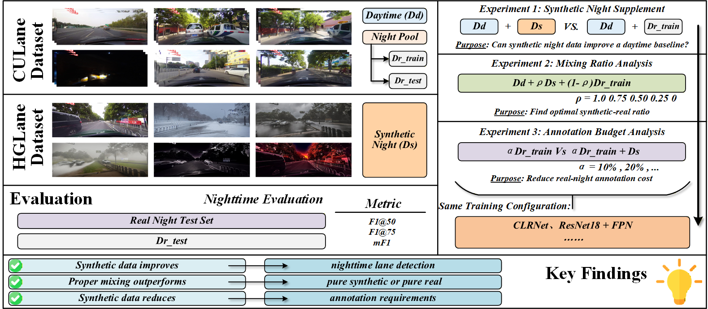

# NightLaneSynth

Official repository for **Synthetic Night Data for Nighttime Lane Detection: Efficiency Analysis and Data Mixing Strategies**.

## Framework

<p align="center">
  
</p>

NightLaneSynth investigates how synthetic nighttime data can improve lane detection under real nighttime driving conditions. The study examines the utility of nighttime images generated using HG-Lane, the synthetic-to-real domain gap, and data mixing strategies that reduce reliance on annotated real nighttime samples.

## Overview

Nighttime lane detection is challenging because of low visibility, motion blur, sensor noise, and complex illumination. Collecting and annotating real nighttime images is expensive, while synthetic data offers a scalable source of additional training examples.

This project addresses three questions:

1. **Synthetic data utility:** Can synthetic nighttime data improve a detector trained on real daytime images?
2. **Domain gap and data mixing:** How does synthetic nighttime data compare with real nighttime data, and which mixing ratios transfer best to real nighttime scenes?
3. **Annotation efficiency:** Can synthetic data maintain competitive performance when only a small number of annotated real nighttime images is available?

The experiments use CLRNet as a common baseline and evaluate performance separately on real and synthetic nighttime test sets.

## Key Findings

- **Synthetic nighttime data improves the daytime baseline.** Adding 3,500 synthetic nighttime images raises real-night F1@50 from **0.5853 to 0.6278**, an improvement of approximately **4.25 percentage points**.
- **A synthetic-to-real gap remains.** In the mixing-ratio experiment, supplementing daytime data with real nighttime images achieves real-night F1@50 of **0.7183**, compared with **0.6371** when the nighttime supplement is entirely synthetic.
- **A mixture can outperform either nighttime source alone.** Among the five tested ratios, **25% synthetic / 75% real** achieves the highest real-night F1@50 (**0.7211**) and mF1 (**0.4706**).
- **Synthetic data helps under limited annotation budgets.** With 500 real nighttime images, adding synthetic nighttime data increases real-night F1@50 from **0.6972 to 0.7147**, approaching the **0.7183** result obtained with 3,500 real nighttime images.

These findings describe the recorded experimental runs. The best ratio is specific to the tested data and training protocol; the small differences between strong configurations have not been established as statistically significant through repeated runs.

## Method

### Data and Baseline

The study builds on:

- **[HG-Lane](https://github.com/zdc233/HG-Lane):** the framework used to obtain synthetic nighttime lane images.
- **[CULane](https://xingangpan.github.io/projects/CULane.html):** the source of real road images and lane annotations.
- **CLRNet:** the lane detection baseline, using a ResNet-18 backbone in the provided experiment configurations. See `CLRNet/README.md` for the baseline documentation.

Real nighttime performance is evaluated on the CULane nighttime test subset. A separate synthetic nighttime test set measures performance in the synthetic domain.

### Experimental Design

**All experiments include the same real daytime training set.** The terms *synthetic-only night* and *real-only night* describe the source of the additional nighttime images; they do not mean that daytime images are excluded.

#### 1. Synthetic Night Supplement

Compare three training sets:

- Real daytime images only.
- Real daytime images + 3,500 synthetic nighttime images.
- Real daytime images + 3,500 real nighttime images.

This experiment measures the benefit of a nighttime supplement and compares synthetic and real sources under an equal nighttime image budget.

#### 2. Mixing Ratio Analysis

Keep the nighttime supplement fixed at **3,500 images** and vary its composition:

| Synthetic / Real | Synthetic Night Images | Real Night Images |
| --- | ---: | ---: |
| 100% / 0% | 3,500 | 0 |
| 75% / 25% | 2,625 | 875 |
| 50% / 50% | 1,750 | 1,750 |
| 25% / 75% | 875 | 2,625 |
| 0% / 100% | 0 | 3,500 |

The two endpoints also provide the synthetic-to-real comparison. They are separate runs from the corresponding supplement experiments, so their recorded scores differ slightly despite having the same data composition.

#### 3. Annotation Budget Analysis

Limit the number of real nighttime training images to **100, 500, or 1,000**. For each budget, compare training with and without **3,500 synthetic nighttime images**.

The real daytime set remains unchanged. Adding synthetic images increases the total training set size in this experiment; the comparison measures annotation efficiency rather than equal training-set size or equal compute cost.

### Data Split

The preparation script computes the mean grayscale intensity of each real training image:

| Mean Grayscale Intensity | Assignment |
| --- | --- |
| At least 80 | Real daytime pool |
| Below 60 | Real nighttime pool |
| From 60 to below 80 | Excluded from both training pools |

These thresholds define brightness-based training pools. The real nighttime test set uses the existing CULane nighttime subset.

The saved split summary contains:

| Split / Pool | Images |
| --- | ---: |
| Original real training set | 88,880 |
| Real daytime training pool | 74,950 |
| Available real nighttime training pool | 10,471 |
| Intermediate-brightness images | 3,459 |
| Full real nighttime supplement | 3,500 |
| Full synthetic nighttime supplement | 3,500 |
| Real nighttime test set | 7,029 |
| Synthetic nighttime test set | 1,000 |

The data sampling seed is **20260617**. Counts refer to the recorded dataset version; retain the corresponding split lists when reproducing these results.

### Training Configuration

| Parameter | Value |
| --- | --- |
| Detector | CLRNet |
| Backbone | ResNet-18 |
| Backbone pretraining | Disabled in the experiment configurations |
| Epochs | 12 |
| Batch size | 24 |
| Optimizer | AdamW |
| Initial learning rate | 0.0006 |
| Learning-rate schedule | Cosine annealing |
| Network input size | 800 × 320 |
| Original image coordinate size | 1640 × 590 |
| Top crop | 270 pixels |
| Training seed | 0 by default in the training entry point |
| Evaluation checkpoint | Final-epoch checkpoint, `11.pth` |

The data sampling seed and the training seed serve different purposes. The evaluation script selects the latest run directory containing `ckpt/11.pth`; it does not select the best checkpoint by test performance.

## Results Summary

All scores below are reported on a **0–1 scale** and rounded to four decimal places:

- **F1@50:** lane detection F1 at IoU 0.50.
- **F1@75:** lane detection F1 at IoU 0.75.
- **mF1:** mean F1 over IoU thresholds 0.50, 0.55, ..., 0.95.
- **Real / Syn.:** evaluation on the real nighttime / synthetic nighttime test set.

The tables summarize the saved evaluation JSON files in `night_mixing_study_v2/results/`.

### Synthetic Night Supplement

| Setting | Real F1@50 | Real F1@75 | Real mF1 | Syn. mF1 |
| --- | ---: | ---: | ---: | ---: |
| Day only | 0.5853 | 0.4224 | 0.3808 | 0.6293 |
| Day + synthetic night | 0.6278 | 0.4496 | 0.4055 | 0.6905 |
| Day + real night | 0.7180 | 0.5150 | 0.4671 | 0.6564 |

Synthetic nighttime images improve transfer to real nighttime scenes, but an equal-sized real nighttime supplement provides a larger gain.

### Synthetic-to-Real Gap

The following results are the endpoints of the mixing-ratio experiment. Both settings also include the real daytime training set.

| Nighttime Supplement | Real F1@50 | Real F1@75 | Real mF1 | Syn. mF1 |
| --- | ---: | ---: | ---: | ---: |
| Synthetic-only night | 0.6371 | 0.4437 | 0.4065 | 0.6879 |
| Real-only night | 0.7183 | 0.5115 | 0.4653 | 0.6510 |

The synthetic supplement scores higher on the synthetic test set, while the real supplement scores higher on the real nighttime test set. This highlights the importance of evaluating target-domain performance when assessing synthetic data.

### Mixing Ratio Analysis

| Mix Ratio (Syn. / Real) | Real F1@50 | Real F1@75 | Real mF1 | Syn. mF1 |
| --- | ---: | ---: | ---: | ---: |
| 100% / 0% | 0.6371 | 0.4437 | 0.4065 | 0.6879 |
| 75% / 25% | 0.7138 | 0.5092 | 0.4626 | 0.6850 |
| 50% / 50% | 0.7148 | 0.5060 | 0.4628 | 0.6842 |
| **25% / 75%** | 0.7211 | 0.5192 | 0.4706 | 0.6788 |
| 0% / 100% | 0.7183 | 0.5115 | 0.4653 | 0.6510 |

The **25% synthetic / 75% real** mixture is the best observed configuration for all three real-night metrics in this sweep. It uses **2,625 real nighttime images**, 25% fewer than the all-real nighttime supplement, together with 875 synthetic images. Its real-night F1@50 is approximately **0.28 percentage points** higher than the all-real endpoint.

### Annotation Budget Analysis

| Real Night Images | Added Synthetic Night Images | Real F1@50 | Real F1@75 | Real mF1 | Syn. mF1 |
| --- | ---: | ---: | ---: | ---: | ---: |
| 100 | 0 | 0.6729 | 0.4674 | 0.4278 | 0.6399 |
| 100 | 3,500 | 0.6852 | 0.4831 | 0.4383 | 0.6866 |
| 500 | 0 | 0.6972 | 0.4851 | 0.4446 | 0.6469 |
| 500 | 3,500 | 0.7147 | 0.5005 | 0.4592 | 0.6881 |
| 1000 | 0 | 0.7091 | 0.5064 | 0.4600 | 0.6342 |
| 1000 | 3,500 | 0.7159 | 0.5091 | 0.4624 | 0.6871 |

Adding synthetic nighttime data improves all three real-night metrics at each tested real-data budget. The real-night F1@50 gains are approximately **1.23**, **1.75**, and **0.68 percentage points** for budgets of 100, 500, and 1,000 real images, respectively.

With **500 real + 3,500 synthetic** nighttime images, F1@50 reaches **0.7147**, compared with **0.7183** for the 3,500-real-image mixing endpoint. This uses approximately **85.7% fewer real nighttime annotations**, with an F1@50 gap of approximately **0.36 percentage points**. This comparison concerns real nighttime annotation counts; it does not include synthetic generation costs or imply identical training compute.

## Repository Structure

The layout below follows the existing experiment implementation and describes the code and small metadata files to include in the release. Large datasets, checkpoints, and generated predictions are stored separately.

```text
NightLaneSynth/
├── README.md
├── V4.png
├── CLRNet/
│   ├── clrnet/                           # Detector, datasets, metrics, CUDA sources
│   ├── configs/                          # Baseline configurations
│   ├── tools/
│   ├── main.py                           # Training entry point
│   ├── setup.py
│   ├── requirements.txt
│   ├── README.md
│   └── LICENSE
├── night_mixing_prepare_clrnet_study_v2.py # Split and experiment preparation
├── night_mixing_eval_clrnet_v2.py          # Real/synthetic nighttime evaluation
├── night_mixing_launch_v2.sh              # Optional batch launcher
├── night_mixing_run_clrnet_queue_v2_*.sh   # Optional experiment queues
├── night_mixing_study_v2/
│   ├── configs/                          # Experiment configurations
│   ├── datasets/<experiment>/list/        # Split lists, not image copies
│   └── results/                          # Evaluation JSON and split metadata
├── culane.py                             # Optional ComfyUI generation client
├── sampling.py                           # Source-image sampling helper
├── process.py                            # Generated-image organization helper
├── v11_canny.json                         # Canny workflow
└── v11_canny_p2p.json                     # Canny + IP2P workflow
```

The directory names `exp1_*`, `exp3_*`, and `exp4_*` correspond to the supplement, mixing-ratio, and annotation-budget experiments. The synthetic-to-real comparison reuses the mixing endpoints and is not a separate fourth training group. There are **14 experiment configurations** in total.

## Getting Started

### 1. Clone the Repository

```bash
git clone https://github.com/jylEcho/NightLaneSynth.git
cd NightLaneSynth
```

The commands below assume the code files in the layout above have been included in the checkout. A documentation-only checkout is not sufficient to run training.

### 2. Prepare the Training Environment

The existing scripts target a Linux environment with an NVIDIA GPU and CUDA. The local CLRNet dependency file specifies historical versions, including `torch==1.8.0`, `torchvision==0.9.0`, and `mmcv==1.2.5`; the original queue scripts reference Python 3.8.

After preparing a compatible Python, PyTorch, CUDA, and compiler environment:

```bash
cd CLRNet
python -m pip install -r requirements.txt
python setup.py build develop
cd ..
```

CLRNet includes a compiled CUDA extension. Use the training dependencies in `CLRNet/requirements.txt`, and keep the ComfyUI generation environment separate. The dependency file is not a complete environment lock; installation in a fresh environment may require resolving compatibility issues.

### 3. Prepare the Datasets

Obtain the source data and generation resources from their original projects:

- **HG-Lane:** <https://github.com/zdc233/HG-Lane>
- **CULane:** <https://xingangpan.github.io/projects/CULane.html>

Both real and synthetic data must use the expected CULane-style layout, including images, `.lines.txt` lane annotations, segmentation masks, and split lists. The preparation script reads:

```text
REAL_ROOT/
├── driver_*/
├── laneseg_label_w16/
└── list/
    ├── train_gt.txt
    ├── val.txt
    └── test_split/test8_night.txt

SYN_ROOT/
├── night/                  # Images and corresponding .lines.txt annotations
├── laneseg_label_w16/
└── list/
    ├── train_gt.txt
    └── test.txt
```

Update the following constants in `night_mixing_prepare_clrnet_study_v2.py`:

```python
STUDY_ROOT = Path('/absolute/path/to/NightLaneSynth/night_mixing_study_v2')
REAL_ROOT = Path('/absolute/path/to/CULane')
SYN_ROOT = Path('/absolute/path/to/CULane_6x5k')
```

Set `STUDY_ROOT` to the same value in `night_mixing_eval_clrnet_v2.py`. The preparation script creates dataset links, split lists, configurations, and metadata:

```bash
python night_mixing_prepare_clrnet_study_v2.py
```

**Fresh-setup requirement:** the current preparation script does not generate the `list/test_split/` files read by the local CLRNet category evaluator. Preserve the corresponding lists from the experiment release, or update the evaluator to use the intended available splits before running training or evaluation. The lists must match the prediction set; copying unrelated full-test lists is insufficient.

### 4. Train a Single Experiment

From the repository root, set paths that match the preparation scripts:

```bash
REPO_ROOT="$PWD"
STUDY_ROOT="$REPO_ROOT/night_mixing_study_v2"
EXP_NAME=exp1_day_only

cd "$REPO_ROOT/CLRNet"

# Clear split-specific annotation caches before switching experiments.
rm -f cache/culane_train.pkl cache/culane_val.pkl cache/culane_test.pkl

python main.py "$STUDY_ROOT/configs/${EXP_NAME}.py" --gpus 0 --seed 0
```

Examples of other experiment names:

| Experiment | Configuration Name |
| --- | --- |
| Day + synthetic night | `exp1_day_plus_syn_night_full` |
| Day + real night | `exp1_day_plus_real_night_full` |
| 25% synthetic / 75% real night | `exp3_mix_syn25_real75` |
| 500 real nighttime images | `exp4_real_budget_500` |
| 500 real + full synthetic night | `exp4_real_budget_500_plus_syn_full` |

### 5. Evaluate

In the same shell, after training has produced the checkpoint:

```bash
PYTHONPATH="$REPO_ROOT/CLRNet:${PYTHONPATH:-}" \
  python "$REPO_ROOT/night_mixing_eval_clrnet_v2.py" \
  --exp-name "$EXP_NAME"
```

The evaluator loads the experiment configuration, generates lane predictions, and computes real and synthetic nighttime metrics separately. It writes a JSON file to:

```text
night_mixing_study_v2/results/<experiment_name>.json
```

Each result includes the checkpoint path, prediction directory, and the three metrics for each evaluation domain.

### 6. Optional Batch Execution

The A/B/C queue scripts organize the 14 experiments into separate working copies. Before using `night_mixing_launch_v2.sh`:

- Update the repository paths, Conda initialization path, environment name, and library paths.
- Copy the evaluation script into `$STUDY_ROOT/scripts/`, as expected by the queues, or update their invocation to use the root-level script.
- Set GPU assignments explicitly. The existing queues all use `--gpus 0`; queue labels do not automatically select different GPUs.

Validate a single experiment before launching concurrent jobs.

## Synthetic Image Generation

The optional `culane.py` client submits workflows to a local ComfyUI server at `http://localhost:8188`. It uses Canny guidance and, for nighttime and dusk, an additional IP2P ControlNet workflow. The experiment reported here uses the nighttime portion of the generated data.

The workflow files reference:

- `v1-5-pruned-emaonly-fp16.safetensors`
- `control_v11p_sd15_canny.pth`
- `control_v11e_sd15_ip2p.pth`

Prepare the required models separately and place input images and lane annotations under `data/HGLane/normal/`, using names such as `normal_0.jpg` and `normal_0.lines.txt`. The ComfyUI output directory must match the client's `OUTPUT_ROOT`.

A small generation test can be run from the repository root:

```bash
HGLANE_LIMIT=1 python culane.py
```

This processes one source image and generates the five scene types configured in `LABEL_SETTINGS`. Preparing the final training dataset additionally requires consistent image encoding, image/annotation geometry, segmentation masks, and split lists.

## Reproducibility Notes

- **Recorded results:** the tables describe saved runs; they are not averages over multiple training seeds.
- **Split integrity:** retain source-image identifiers when producing synthetic variants and check that variants of the same source image do not cross training, validation, and test boundaries. The available sampling helper reads the CULane normal-test list, so source provenance must be reviewed when reconstructing the dataset.
- **Image and annotation alignment:** the supplied generation workflows output 1600 × 576 images, whereas the training/evaluation coordinate system uses 1640 × 590. Consistent resizing and annotation processing must be verified during dataset preparation. The current generation helper renames PNG output to `.jpg` without re-encoding it.
- **Path and cache handling:** the scripts retain original server paths, and CLRNet caches annotations by split name. Update paths and clear the relevant caches when changing experiments.
- **Generation-to-training preparation:** image generation alone does not produce all artifacts needed for training. Use the documented dataset format and the matching experimental split lists.

## Data Availability

The project repository is **[NightLaneSynth](https://github.com/jylEcho/NightLaneSynth)**. Experiment metadata, split definitions, and evaluation summaries are the small artifacts associated with this study; complete image datasets and trained model weights should not be assumed to be included in a source-code checkout.

NightLaneSynth builds on publicly available resources:

- **HG-Lane:** <https://github.com/zdc233/HG-Lane>
- **CULane:** <https://xingangpan.github.io/projects/CULane.html>

Obtain the original data and generation resources from those projects. The exact processed nighttime dataset and trained checkpoints require separate release/download information when provided. Users should follow the licenses and usage terms accompanying the original datasets and models.

## Acknowledgments

We thank the authors and maintainers of **HG-Lane**, **CULane**, **CLRNet**, and **ComfyUI** for the resources supporting this study. Please acknowledge the original projects when using their code, data, or models. Third-party components retain their accompanying license and attribution files.
